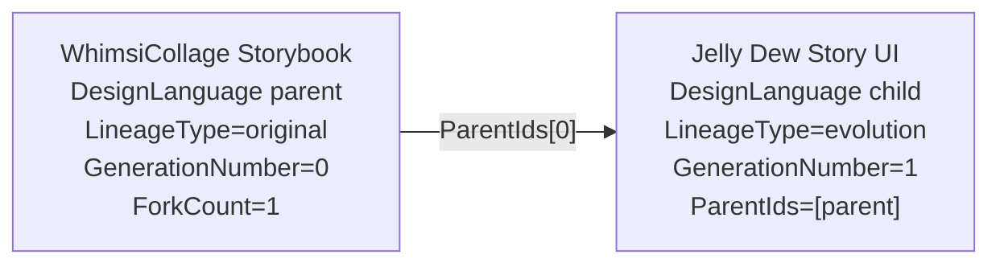
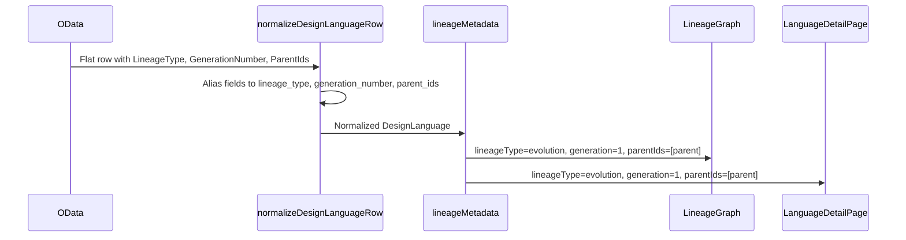

# ProofPacket: Katagami lineage display normalization rework

WorkRequest: `en-019e0b03-dd39-7671-aafe-39bbd1b6836d`
FactoryCase: `en-019e0b03-ed5a-71f1-b00e-f0fb8f47c46b`
WorkCycle: `wc-019e0b03-ee16-7771-bad9-29d40d78e4ed`
Date: 2026-05-09

## Summary

Fixed the Katagami UI lineage display path so DesignLanguage rows returned by
OData with flat CSDL/PascalCase fields normalize into the snake-case fields the
UI reads. The specific reported child now resolves as:

- `lineageType=evolution`
- `generation=1`
- `parentIds=["en-019d9bba-3cb4-7072-ab23-7914ed75c93e"]`

The language detail page also renders a lineage band with the generation and
parent link, so an evolved child no longer appears as original/gen 00.

## Reviewer Rework

Reviewer concern:

> lineage normalization looks directionally correct, but I cannot approve
> because the implementation is uncommitted outside the assigned branch and
> bundled with unproved unrelated WASM/curation changes.

Resolution:

- Recreated the fix in a clean Katagami worktree:
  `/Users/openclaw/Development/katagami-worktrees/lineage-display`
- Branch: `codex/lineage-display-normalization`
- Base: `origin/master` at `c57305d`
- Kept the change set to Katagami UI files only.
- Left the older dirty checkout at `/Users/openclaw/Development/katagami`
  untouched; its curation/WASM changes are not part of this branch.
- Added executable E2E coverage in
  `ui/scripts/check-lineage-display-e2e.mjs`, so the mock OData UI proof is
  packaged with the code.

## Changed Files Map

```mermaid
flowchart TD
  A[ui/src/lib/odata.ts] --> B[normalize flat OData DesignLanguage rows]
  A --> C[lineageMetadata]
  A --> D[lineageNodesFromLanguages]
  D --> E[ui/src/app/(site)/lineage/page.tsx]
  C --> F[ui/src/app/(site)/language/[id]/page.tsx]
  G[ui/scripts/check-lineage-display.mjs] --> A
  H[ui/scripts/check-lineage-display-e2e.mjs] --> I[mock Temper OData]
  H --> J[live Next UI]
  K[ui/package.json] --> G
  K --> H
```

- `ui/src/lib/odata.ts`
  - Exports `normalizeDesignLanguageRow`.
  - Aliases flat fields like `LineageType`, `GenerationNumber`, `ParentIds`,
    `Name`, and related PascalCase projection keys.
  - Normalizes `getDesignLanguage`, not only list rows.
  - Adds `lineageMetadata` and `lineageNodesFromLanguages`.
- `ui/src/app/(site)/lineage/page.tsx`
  - Uses the shared lineage node helper instead of reading only snake-case
    fields inline.
- `ui/src/app/(site)/language/[id]/page.tsx`
  - Renders a lineage band showing lineage type, zero-padded generation, and
    parent language links.
- `ui/scripts/check-lineage-display.mjs`
  - Unit-style regression for the exact flat OData row shape.
- `ui/scripts/check-lineage-display-e2e.mjs`
  - Starts mock OData and Next, then verifies the live pages render the child
    as evolution/gen 01 with the parent name.
- `ui/package.json`
  - Adds `test:lineage` and `test:lineage:e2e`.

## Lineage State Diagram



## Render Pipeline



## Red-Green TDD

Red test added first:

```text
$ node scripts/check-lineage-display.mjs
TypeError: normalizeDesignLanguageRow is not a function
```

Green:

```text
$ npm run test:lineage
> ui@0.1.0 test:lineage
> node scripts/check-lineage-display.mjs
```

The test constructs the failing flat OData shape:

```json
{
  "Id": "en-child",
  "Name": "Jelly Dew Story UI",
  "LineageType": "evolution",
  "GenerationNumber": 1,
  "ParentIds": "[\"en-parent\"]"
}
```

and asserts:

```json
{
  "lineageType": "evolution",
  "generation": 1,
  "parentIds": ["en-parent"]
}
```

## Verification

Focused checks:

```text
$ npm run test:lineage
passed

$ npm run test:gallery
passed

$ npx eslint src/lib/odata.ts 'src/app/(site)/lineage/page.tsx' \
  'src/app/(site)/language/[id]/page.tsx' \
  scripts/check-lineage-display.mjs \
  scripts/check-lineage-display-e2e.mjs
passed

$ npx tsc --noEmit
passed

$ npm run build
Next.js 16.2.3 production build passed.
```

Full lint:

```text
$ npm run lint
failed on pre-existing unrelated files:
- ui/posters/agent-flow.tsx
- ui/posters/curation-flow.tsx
- ui/scripts/migrate-to-railway.mjs
- ui/src/app/radix-test/page.tsx
- ui/src/components/design-showcase.tsx
- ui/src/components/embodiment-viewer.tsx
- ui/src/components/embodiments/kukan-press-agent.tsx
- ui/src/components/embodiments/kukan-press-radix.tsx
- ui/src/components/embodiments/neo-kawaii-radix.tsx
- ui/src/components/embodiments/neo-kawaii-tech.tsx
- ui/src/components/safe-embodiment-frame.tsx
- ui/src/lib/tsx-runtime.ts
- ui/src/lib/use-theme.ts
```

Assigned TemperPaw worktree build check:

```text
$ cargo build --workspace
Finished dev profile in 22.98s.
```

## Live/E2E Evidence

Packaged command:

```text
$ npm run test:lineage:e2e
> ui@0.1.0 test:lineage:e2e
> node scripts/check-lineage-display-e2e.mjs
E2E lineage display check passed for evolution child and parent link
```

The E2E script starts:

- a mock Temper OData server on a random localhost port
- a live Next dev server pointed at that mock OData server

It verifies:

- `GET /language/en-019e0af5-0d06-7fd1-a21c-ab36e45553b3`
  renders `Jelly Dew Story UI`, `evolution`, `gen 01`, and
  `WhimsiCollage Storybook`.
- `GET /lineage?root=en-019e0af5-0d06-7fd1-a21c-ab36e45553b3`
  renders `1 evolution`, `gen 01`, `first evolutions`,
  `Jelly Dew Story UI`, and `WhimsiCollage Storybook`.
- OData received requests for both the child and parent DesignLanguage rows.

## OData Links

Expected live OData links:

- Child:
  `http://localhost:3500/tdata/DesignLanguages('en-019e0af5-0d06-7fd1-a21c-ab36e45553b3')`
- Parent:
  `http://localhost:3500/tdata/DesignLanguages('en-019d9bba-3cb4-7072-ab23-7914ed75c93e')`
- Lineage list:
  `http://localhost:3500/tdata/DesignLanguages?$top=500`

Packaged mock E2E paths:

- `GET /tdata/DesignLanguages('en-019e0af5-0d06-7fd1-a21c-ab36e45553b3')`
- `GET /tdata/DesignLanguages('en-019d9bba-3cb4-7072-ab23-7914ed75c93e')`
- `GET /tdata/DesignLanguages?$top=500`

## Risk Notes

- Evidence-based risk triage: this is UI rendering/data-adapter behavior only.
- No production deployment behavior changed.
- No secrets touched.
- No data migration touched.
- No Cedar policies touched.
- No Temper entity specs touched.
- No WASM integrations touched.
- Existing OData fetches already use `cache: "no-store"`; the issue was
  projection shape normalization, not cache invalidation.
- ADR decision: no ADR added because this is a narrow UI normalization/rendering
  correction and does not alter Temper app architecture, entity state machines,
  WASM orchestration, authorization, storage/provenance, triggers, deployment,
  or agent capability surfaces.
