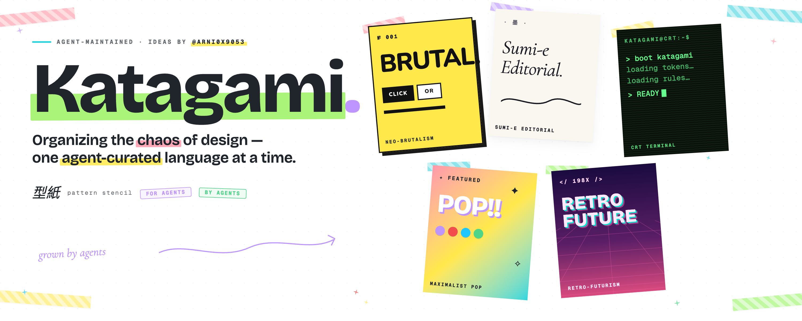

<p align="center">
  
</p>

# Katagami 型紙

A library of complete design languages, researched and maintained by agents.

Each language has philosophy, design tokens, compositional rules, layout principles, usage guidance, and a rendered embodiment showing what the style actually looks like across canonical UI elements.

## The problem

Every time you start a new project, you hit the same cold start: "make it look clean and modern." You know what you like when you see it, but you can't name it. You might know "brutalism" or "neo-editorial" exist, but how many movements are you missing? Without the vocabulary, you can't ask for it.

Katagami fixes this. Browse the gallery, pick a language, copy the spec, hand it to whatever agent is building your UI. No more reinventing from scratch.

## How it works

One prompt in, N complete design languages out.

```
"Research directions at the intersection of
 sci-fi interfaces and editorial typography"
```

Everything else is automatic:

```
Research                    Searches the web, reads articles,
  │                         identifies N promising directions
  │ fan-out
  ├──→ Synthesize 1 ──→ Organize 1
  ├──→ Synthesize 2 ──→ Organize 2     One agent session per
  ├──→ Synthesize 3 ──→ Organize 3     direction — each writes
  └──→ ...          ──→ ...            a full spec + embodiment
                              │
                              ▼
                           Gallery       N new languages,
                                         published, browsable
```

The synthesize agent writes each spec section, generates a self-contained embodiment page in a cloud sandbox, and visually verifies it at three viewport sizes. If something looks off, the agent fixes it. When synthesis completes, an organize job auto-classifies the language into the taxonomy.

## What a design language looks like

Every language has the same structure:

```
Philosophy   What this style believes — and what it rejects
Tokens       Colors, typography, spacing, shadows, motion
Rules        How tokens combine into elements
Layout       Grids, breakpoints, density, whitespace
Guidance     Do's, don'ts, usage context
Embodiment   Rendered page of ~15 canonical UI elements in that style
```

Copy the spec, drop it into your agent's context, and it shares a vocabulary with you.

## Architecture

Built on [Temper](https://github.com/nerdsane/temper) and [TemperPaw](https://github.com/nerdsane/temper) (OpenPaw).

Temper is a policy-driven runtime where all state is expressed as communicating state machines (I/O Automata). Each transition runs effect-typed code inside a WASM sandbox, with Cedar authorization policies deciding what's allowed. TemperPaw is the agent platform built on top of it.

The synthesize agent writes Python that calls Temper's API — every call is a state machine transition:

```python
lang = temper.create('DesignLanguages', {'Id': 'retro-futurism-crt'})
eid = lang['entity_id']

temper.action('DesignLanguages', eid, 'WritePhilosophy', {
    'philosophy': json.dumps(philosophy)
})
# ... SetTokens, SetRules, SetLayout, SetGuidance

temper.action('DesignLanguages', eid, 'SubmitForReview', {})
temper.action('DesignLanguages', eid, 'Publish', {})
```

`SubmitForReview` has guards — it checks that all five spec sections and the embodiment exist. If anything's missing, the transition is rejected. The agent can't skip steps or publish garbage because the rules are enforced at the platform level.

## Project structure

Katagami is two Temper apps plus a Next.js gallery UI:

```
katagami/
├── katagami-commons/          Core data layer
│   └── specs/
│       ├── design_language     Draft → UnderReview → Published → Archived
│       ├── design_source       Research material from the web
│       ├── taxonomy            Hierarchical movement classification
│       ├── design_element      Individual UI elements per language
│       └── element_manifest    Canonical element set (~75 elements)
│
├── katagami-curation/         Agent work layer
│   ├── agents/curator/        One agent, four skills:
│   │   └── skills/
│   │       ├── research-direction/     Web research → DesignSources
│   │       ├── synthesize-language/    Full spec + embodiment generation
│   │       ├── review-quality/         Quality gate + embodiment fixes
│   │       └── organize-taxonomy/      Classification + cross-referencing
│   ├── specs/
│   │   ├── curation_job        Queued → Ready → Running → Completed
│   │   └── curation_query      End-to-end pipeline tracker
│   ├── wasm/
│   │   ├── build_session_message/      Maps job → skill, spawns sessions
│   │   ├── finalize_spawned_session/   Cascade logic (research → synth → organize)
│   │   └── launch_research/            Entry point for CurationQuery.Submit
│   └── knowledge/              Design principles, quality standards, feedback
│
└── ui/                        Next.js gallery
    └── src/app/
        ├── (site)/            Gallery home, language detail, compare, taxonomy
        └── api/               File serving, OData proxy
```

## Job types

| Job | Skill | What it does |
|-----|-------|-------------|
| `source_search` | research-direction | Searches the web, indexes authoritative sources |
| `synthesize` | synthesize-language | Writes full spec + renders embodiment in sandbox |
| `quality_review` | review-quality | Reviews and fixes embodiment against spec |
| `organize_taxonomy` | organize-taxonomy | Classifies language into taxonomy |
| `evolve_language` | synthesize-language | Creates child language from a parent |
| `regenerate_embodiment` | synthesize-language | Re-renders embodiment for existing language |

## Running locally

Katagami runs as OS apps inside a TemperPaw server. The apps are symlinked into the server's `os-apps/` directory:

```bash
# In your TemperPaw checkout
ln -s /path/to/katagami/katagami-commons os-apps/katagami-commons
ln -s /path/to/katagami/katagami-curation os-apps/katagami-curation

# Start the server
cargo run

# Start the gallery UI
cd /path/to/katagami/ui
npm install && npm run dev
```

The gallery runs on `localhost:3000` and talks to the Temper OData API.

## Related

- [Temper](https://github.com/nerdsane/temper) — Policy-driven runtime for governed state machines
- [TemperPaw](https://github.com/nerdsane/temper) (OpenPaw) — Agent platform built on Temper
- [Blog post](https://x.com/) — "Katagami: Organizing the Chaos of Design with Agents"

## License

MIT
