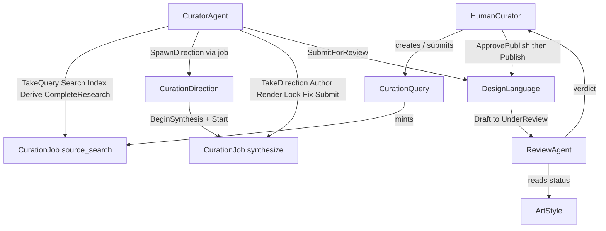

# Katagami as a joint cognitive system

**Branch:** [`grok/jcs-study-setup`](https://github.com/arni-labs/katagami/tree/grok/jcs-study-setup) · **PR:** [arni-labs/katagami#213](https://github.com/arni-labs/katagami/pull/213) · **Date:** 2026-08-13

We are defining Katagami’s live curation pipeline as a joint cognitive system: a human and two agent principals, plus the existing app objects, with conduct specified three ways — a skill (what we tell the agent), a `BEHAVIOR.md` (what a judge reads as prose), and an IOA state machine (what Temper refuses or allows). The evaluation is: run Claude Code on the live app, capture the trajectory, and score the same inventory twice — once against `BEHAVIOR.md`, once against the machine — to see whether the two encodings agree, and where they do not.

Temper verifier changes (budget counted as unique states; projecting fat catalog types down to `status` in the joint BFS) are **parked**. Not in this write-up’s next work.

---

## What we designed

Three principals on the **live** Katagami apps (`katagami-curation` + `katagami-commons`). Not a parallel pipeline.

| Principal | Who | This phase |
|---|---|---|
| **CuratorAgent** | One curator process | `source_search` then `synthesize` only |
| **ReviewAgent** | A different principal | Examine a language that is already `UnderReview` |
| **HumanCurator** | A person | Decide publish; agent may `Publish` only after `ApprovePublish` |

Live objects the machines join: `CurationQuery`, `CurationJob`, `CurationDirection`, `DesignLanguage`, `ArtStyle`, `DesignSource`.

Research hold (one Claude Code session, one ledger):

`Idle → ReadingQuery → Searching → SourcesReady → DirectionsReady → Idle`

Synthesize hold (a **different** Claude Code session, a new ledger):

`Idle → ReadingDirection → Authoring → SurfacesRendered → Looking ⇄ Authoring → LanguageUnderReview → Idle`

Cross-entity guards are the join: `TakeQuery` needs a `Running` job and a `Researching` query; `CompleteResearch` needs ≥ 3 directions and a `Finalizing`/`Completed` job; `ReadDesignRules` needs a `Draft` language; `SubmitLanguage` / `CompleteSynthesis` need `UnderReview`.

Named curator invariants (craft, not “look”): `SeenBeforeSubmit`, `OneLanguageOneSubmit`, `LanguageHasEveryPart`, `FixRoundsBounded`, `AbandonedIsFinal`. Liveness: `QueryEventuallyResolves`, `DirectionEventuallyResolves`, `LanguageEventuallyResolves`.

---

## What we give each agent

Same inventory numbers (`C1`–`C28`) in all three encodings. Skills tell Claude what to do; the machine refuses illegal order; `BEHAVIOR.md` is the prose judge’s only reference.

**Curator**

- Study skill (what CC is handed): [`.agents/skills/katagami-study-curator/SKILL.md`](https://github.com/arni-labs/katagami/blob/grok/jcs-study-setup/.agents/skills/katagami-study-curator/SKILL.md)
- Production work it must follow: [`research-direction`](https://github.com/arni-labs/katagami/blob/grok/jcs-study-setup/katagami-curation/agents/curator/skills/research-direction/SKILL.md), [`synthesize-language`](https://github.com/arni-labs/katagami/blob/grok/jcs-study-setup/katagami-curation/agents/curator/skills/synthesize-language/SKILL.md)
- Session prompts: [`SESSION-RESEARCH.md`](https://github.com/arni-labs/katagami/blob/grok/jcs-study-setup/docs/study/SESSION-RESEARCH.md), [`SESSION-SYNTH.md`](https://github.com/arni-labs/katagami/blob/grok/jcs-study-setup/docs/study/SESSION-SYNTH.md)
- Machine: [`curator_agent.ioa.toml`](https://github.com/arni-labs/katagami/blob/grok/jcs-study-setup/katagami-curation/specs/curator_agent.ioa.toml)
- Prose: [`curator-agent/BEHAVIOR.md`](https://github.com/arni-labs/katagami/blob/grok/jcs-study-setup/.agents/behaviors/curator-agent/BEHAVIOR.md)

**Reviewer** (not yet run live)

- Skill: [`katagami-study-reviewer/SKILL.md`](https://github.com/arni-labs/katagami/blob/grok/jcs-study-setup/.agents/skills/katagami-study-reviewer/SKILL.md)
- Machine: [`review_agent.ioa.toml`](https://github.com/arni-labs/katagami/blob/grok/jcs-study-setup/katagami-curation/specs/review_agent.ioa.toml)
- Prose: [`review-agent/BEHAVIOR.md`](https://github.com/arni-labs/katagami/blob/grok/jcs-study-setup/.agents/behaviors/review-agent/BEHAVIOR.md)

**Human** (not yet run; we will not fake `ApprovePublish`)

- Skill: [`katagami-study-human/SKILL.md`](https://github.com/arni-labs/katagami/blob/grok/jcs-study-setup/.agents/skills/katagami-study-human/SKILL.md)
- Machine: [`human_curator.ioa.toml`](https://github.com/arni-labs/katagami/blob/grok/jcs-study-setup/katagami-curation/specs/human_curator.ioa.toml)
- Prose: [`human-curator/BEHAVIOR.md`](https://github.com/arni-labs/katagami/blob/grok/jcs-study-setup/.agents/behaviors/human-curator/BEHAVIOR.md)
- Cedar: [`human_curator.cedar`](https://github.com/arni-labs/katagami/blob/grok/jcs-study-setup/katagami-curation/specs/policies/human_curator.cedar)

**Judge** — [`JUDGE.md`](https://github.com/arni-labs/katagami/blob/grok/jcs-study-setup/docs/study/JUDGE.md). Inventory: [`behavior-inventory.md`](https://github.com/arni-labs/katagami/blob/grok/jcs-study-setup/docs/study/behavior-inventory.md). Decisions: [`DECISIONS.md`](https://github.com/arni-labs/katagami/blob/grok/jcs-study-setup/docs/study/DECISIONS.md).

Out of score (D2): C7, C9, C17, R13.

`katagami-contributor` is not a trial skill.

---

## What we have run

Live Temper: isolated `:3472`. Specs loaded with `merge: true`. Claude Code drove the curator.

**Research (judged).** One CC session. Ledger `en-019ffcef-eddd-76b1-9f8b-d1a7923e720b`. 3 searches, 6 sources, 4 directions (Keyblock Grid, Nishiki Modernism, Ukiyo Measure, Flat Wave Rationalism). First `CompleteResearch` 409 until the job was Finalizing, then 200. Both judges: fold **true / 1.0 / 25 units**, every unit the same verdict. 9 true (C1–C5, C10–C13, C17); 16 na. Taste units C20–C28 were na — there was no language. Agreement here is almost tautological: both encodings restated the same 200/409 order the machine already enforced. Evidence: [`judge-research-fold.txt`](https://github.com/arni-labs/katagami/blob/grok/jcs-study-setup/docs/study/evidence/judge-research-fold.txt).

**Synthesize (not judged).** A second CC session on direction Keyblock Grid. Ledger `en-019ffd07-7549-7d12-a618-3b985e5155fa`. Language [Keyblock](https://github.com/arni-labs/katagami/blob/grok/jcs-study-setup/docs/study/artifacts/keyblock/DESIGN.md) `en-019ffd07-2349-7e22-94f5-174852213c0b` reached **UnderReview**. Nothing published. The synthesize **job** did not reach `Completed` (file-id / finalizer shape on this server). This is the session where the two judges can actually diverge (C6–C9, C20–C28). We have not scored it.

**Review + human publish.** Not run.

**Per-entity Temper verify (release, both apps).** ALL PASSED. CuratorAgent 37 754 states, ReviewAgent 144 608, DesignLanguage 835 728 (~118s), HumanCurator 50.

**Composite (joint) verify.** Ran. **INCOMPLETE — not a pass.** One 8-type component (`ArtStyle` is only the alphabetical seed): ArtStyle, CurationDirection, CurationJob, CurationQuery, CuratorAgent, DesignLanguage, HumanCurator, ReviewAgent. 65 143 unique joint states, no dropped reaction in that prefix. Isolated types passed. Log: [`temper-verify-both-dirs-release-250k-2026-08-13.txt`](https://github.com/arni-labs/katagami/blob/grok/jcs-study-setup/docs/study/evidence/temper-verify-both-dirs-release-250k-2026-08-13.txt). Bound-from-spec work: [nerdsane/temper#420](https://github.com/nerdsane/temper/pull/420).

---

## Confirmed vs not

**Worked**

- Actor specs exist and are aligned with this phase’s skills and `BEHAVIOR.md` (source_search + synthesize; no TasteRule list; 3–5 directions; human `ApprovePublish`).
- Per-entity L0–L3 on the current machines, in **release**, including CuratorAgent after the checker bound was raised to the spec’s own `min_count`.
- Live guards refuse wrong order (TakeQuery / CompleteResearch / ReadDesignRules 409s with named guards).
- One research CC session, captured and judged on both arms; same fold.
- One synthesize CC session produced a language in UnderReview with embodiment-grade artifacts on disk.

**Not confirmed**

- That `BEHAVIOR.md` and the machine measure the same thing. Research could not show a split (taste units na). Synthesize is not judged.
- Coherence of skill ↔ machine ↔ `BEHAVIOR.md` under more than one research sample.
- ReviewAgent or HumanCurator driven live.
- End-to-end JCS through publish (we will not fake the human).
- A **complete** composite proof of the eight-type join. Incomplete ≠ fail; it is also not verified.
- ~~OTS / conformance API 404~~ — both study sessions now have OTS + ATIF on `:3472` and in `~/.katagami/trajectory-queue/archive/`.
- Engine-spawned synthesize jobs (TemperFS). Study path is `Start` + `BeginSynthesis`.

**Next, if we continue the study**

- Judge the Keyblock synthesize session on both arms.
- More research (and synthesize) samples; read skill / machine / `BEHAVIOR.md` against those traces for drift.
- Review session, then a real human `ApprovePublish`.
- Composite stays Incomplete until Temper’s joint encoding changes (parked) or the product is made small enough to exhaust.
