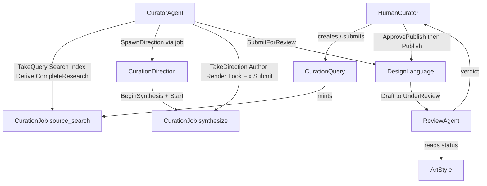

# Katagami as a joint cognitive system

**Branch:** [`grok/jcs-study-setup`](https://github.com/arni-labs/katagami/tree/grok/jcs-study-setup) · **PR:** [arni-labs/katagami#213](https://github.com/arni-labs/katagami/pull/213) · **Date:** 2026-08-13

We are defining Katagami’s live curation pipeline as a joint cognitive system: a human and two agent roles, plus the existing app objects, with conduct specified three ways — a skill (what we tell the agent), a `BEHAVIOR.md` (what a judge reads as prose), and an IOA state machine (what Temper refuses or allows).

The evaluation is: run Claude Code on the live app, capture an ATIF trajectory (below), and score the same trajectory twice (once against `BEHAVIOR.md`, once against the state machine) to see whether the two judgements agree and if/how they differ. The judge looks at the ATIF for whether the acts the agent reported as done are actually done. Taste / whether a design language is good is not part of this experiment.

---

## What we designed

Added "cognitive" actors to the Katagami app:

| Who | Role |
| --- | --- |
| **Curator** | Researches directions, then synthesizes a language. Does not review its own work. Does not publish. |
| **Reviewer** | Examines a language that is already UnderReview and records a verdict. Does not publish. |
| **Human curator** | Decides whether to publish. An agent may press publish only after that decision. |

The overall shape of the Katagami app:

State machines: [CuratorAgent](https://github.com/arni-labs/katagami/blob/grok/jcs-study-setup/katagami-curation/specs/curator_agent.ioa.toml), [ReviewAgent](https://github.com/arni-labs/katagami/blob/grok/jcs-study-setup/katagami-curation/specs/review_agent.ioa.toml), [HumanCurator](https://github.com/arni-labs/katagami/blob/grok/jcs-study-setup/katagami-curation/specs/human_curator.ioa.toml), [CurationQuery](https://github.com/arni-labs/katagami/blob/grok/jcs-study-setup/katagami-curation/specs/curation_query.ioa.toml), [CurationJob](https://github.com/arni-labs/katagami/blob/grok/jcs-study-setup/katagami-curation/specs/curation_job.ioa.toml), [CurationDirection](https://github.com/arni-labs/katagami/blob/grok/jcs-study-setup/katagami-curation/specs/curation_direction.ioa.toml), [DesignLanguage](https://github.com/arni-labs/katagami/blob/grok/jcs-study-setup/katagami-commons/specs/design_language.ioa.toml).

Examples of properties the per-entity checker runs on CuratorAgent (not the full set):

- **Invariant** `SeenBeforeSubmit`: when the language is UnderReview, the landing, embodiment, and dashboard have each been looked at.
- **Liveness** `QueryEventuallyResolves`: from ReadingQuery the hold reaches Idle or Abandoned.

---

## What we give each agent

**Curator**

- Skill: [katagami-study-curator](https://github.com/arni-labs/katagami/blob/grok/jcs-study-setup/.agents/skills/katagami-study-curator/SKILL.md), [research-direction](https://github.com/arni-labs/katagami/blob/grok/jcs-study-setup/katagami-curation/agents/curator/skills/research-direction/SKILL.md), [synthesize-language](https://github.com/arni-labs/katagami/blob/grok/jcs-study-setup/katagami-curation/agents/curator/skills/synthesize-language/SKILL.md)
- Prompt: [SESSION-RESEARCH.md](https://github.com/arni-labs/katagami/blob/grok/jcs-study-setup/docs/study/SESSION-RESEARCH.md), [SESSION-SYNTH.md](https://github.com/arni-labs/katagami/blob/grok/jcs-study-setup/docs/study/SESSION-SYNTH.md)
- State machine: [curator_agent.ioa.toml](https://github.com/arni-labs/katagami/blob/grok/jcs-study-setup/katagami-curation/specs/curator_agent.ioa.toml)
- Behavior: [curator-agent/BEHAVIOR.md](https://github.com/arni-labs/katagami/blob/grok/jcs-study-setup/.agents/behaviors/curator-agent/BEHAVIOR.md)

**Reviewer**

- Skill: [katagami-study-reviewer](https://github.com/arni-labs/katagami/blob/grok/jcs-study-setup/.agents/skills/katagami-study-reviewer/SKILL.md)
- State machine: [review_agent.ioa.toml](https://github.com/arni-labs/katagami/blob/grok/jcs-study-setup/katagami-curation/specs/review_agent.ioa.toml)
- Behavior: [review-agent/BEHAVIOR.md](https://github.com/arni-labs/katagami/blob/grok/jcs-study-setup/.agents/behaviors/review-agent/BEHAVIOR.md)

**Human**

- Skill: [katagami-study-human](https://github.com/arni-labs/katagami/blob/grok/jcs-study-setup/.agents/skills/katagami-study-human/SKILL.md)
- State machine: [human_curator.ioa.toml](https://github.com/arni-labs/katagami/blob/grok/jcs-study-setup/katagami-curation/specs/human_curator.ioa.toml)
- Behavior: [human-curator/BEHAVIOR.md](https://github.com/arni-labs/katagami/blob/grok/jcs-study-setup/.agents/behaviors/human-curator/BEHAVIOR.md)

**Judge** — [JUDGE.md](https://github.com/arni-labs/katagami/blob/grok/jcs-study-setup/docs/study/JUDGE.md)

---

## Trajectories

The judge reads a **trajectory**.

| Format | What it is |
| --- | --- |
| Claude Code `.jsonl` | Raw session transcript the harness writes. |
| **ATIF v1.7** | Harbor’s Agent Trajectory Interchange Format (`steps[]`: messages, tool calls, results). **This is what the judge reads.** |
| **OTS 0.1.0** | Temper’s stored document (`turns[]`). Same run, persisted on the server. |

We store OTS. The judge does not read `turns[]` directly. Temper exports the same document as ATIF (`GET …/atif`). ATIF is what has the tool calls and results a conduct judge needs — whether the agent searched, opened the rulebook, rendered, looked at images — not only that a ledger field flipped.

Pipeline: Claude Code session → `.jsonl` → [Harbor 0.21.0](https://github.com/harbor-framework/harbor) → ATIF → mapped to OTS → `POST /api/ots/trajectories`. How: [hooks/trajectory-capture/](https://github.com/arni-labs/katagami/tree/grok/jcs-study-setup/hooks/trajectory-capture). Converter: [claude_session_to_ots.py](https://github.com/arni-labs/katagami/blob/grok/jcs-study-setup/scripts/trajectory/claude_session_to_ots.py).

**Where they live**

- Server: `GET http://127.0.0.1:3472/api/ots/trajectories/<id>/atif`
- Offline: `~/.katagami/trajectory-queue/archive/<id>.json` (OTS) and `<id>.atif.json` (ATIF)

| Session | `trajectory_id` | ATIF | OTS |
| --- | --- | --- | --- |
| Research | `traj-98368249db11e01879992cf4` | 49 steps | 49 turns |
| Keyblock synthesize | `traj-1ec04abc2c522975dfc9ac1a` | 103 steps | 103 turns |

---

## What we have run

Live Temper: isolated `:3472`. Two Claude Code sessions (research, then Keyblock synthesize). Trajectories are in the table above. **Judgement from those ATIFs is not in this file yet** — update this section after both arms have scored the trajectories.

Per-entity Temper verify (release, both apps): ALL PASSED (CuratorAgent 37 754 states, ReviewAgent 144 608, DesignLanguage 835 728, HumanCurator 50).

Composite (joint) verify: **INCOMPLETE — not a pass.** One 8-type component. 65 143 unique joint states, no dropped reaction in that prefix. Log: [temper-verify-both-dirs-release-250k-2026-08-13.txt](https://github.com/arni-labs/katagami/blob/grok/jcs-study-setup/docs/study/evidence/temper-verify-both-dirs-release-250k-2026-08-13.txt). Bound-from-spec: [nerdsane/temper#420](https://github.com/nerdsane/temper/pull/420).

---

## Confirmed vs not

**Worked**

- Actor specs, skills, and `BEHAVIOR.md` exist for curator, reviewer, and human.
- Per-entity L0–L3 in release, including CuratorAgent after the checker bound matched the spec’s own counts.
- Live guards refuse wrong order (named 409s).
- Two Claude Code sessions captured as ATIF and OTS.

**Not confirmed**

- Whether the two judges agree when they read the ATIFs.
- Reviewer or human curator driven live.
- End-to-end through a real human publish decision.
- A complete composite proof of the eight-type join.

**Next**

- Judge both captured sessions from ATIF, both arms, then put the results here.
- More samples.
- Review session, then a real human publish decision.
- Composite stays Incomplete until the joint encoding can finish (parked).
