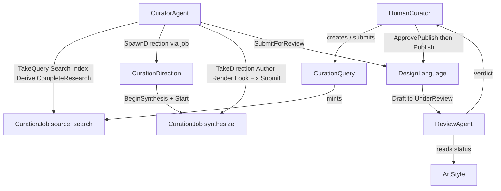

# Katagami as a joint cognitive system

**Branch:** `[grok/jcs-study-setup](https://github.com/arni-labs/katagami/tree/grok/jcs-study-setup)` · **PR:** [arni-labs/katagami#213](https://github.com/arni-labs/katagami/pull/213) · **Date:** 2026-08-13

We are defining Katagami’s live curation pipeline as a joint cognitive system: a human and two agent roles, plus the existing app objects, with conduct specified three ways — a skill (what we tell the agent), a `BEHAVIOR.md` (what a judge reads as prose), and an IOA state machine (what Temper refuses or allows).

The evaluation is: run Claude Code on the live app, capture an ATIF trajectory (below), and score the same trajectory twice (once against `BEHAVIOR.md`, once against the state machine) to see whether the two judgements agree and if/how they differ. The judge looks at the ATIF for whether the acts the agent reported as done are actually done. Taste / whether a design language is good is not part of this experiment.

---

## What we designed

Added "cognitive" actors to the Katagami app:

| Who               | Role                                                                                                |
| ----------------- | --------------------------------------------------------------------------------------------------- |
| **Curator**       | Researches directions, then synthesizes a language. Does not review its own work. Does not publish. |
| **Reviewer**      | Examines a language that is already UnderReview and records a verdict. Does not publish.            |
| **Human curator** | Decides whether to publish. An agent may press publish only after that decision.                    |

The overall shape of the Katagami app:

State machines: [CuratorAgent](https://github.com/arni-labs/katagami/blob/grok/jcs-study-setup/katagami-curation/specs/curator_agent.ioa.toml), [ReviewAgent](https://github.com/arni-labs/katagami/blob/grok/jcs-study-setup/katagami-curation/specs/review_agent.ioa.toml), [HumanCurator](https://github.com/arni-labs/katagami/blob/grok/jcs-study-setup/katagami-curation/specs/human_curator.ioa.toml), [CurationQuery](https://github.com/arni-labs/katagami/blob/grok/jcs-study-setup/katagami-curation/specs/curation_query.ioa.toml), [CurationJob](https://github.com/arni-labs/katagami/blob/grok/jcs-study-setup/katagami-curation/specs/curation_job.ioa.toml), [CurationDirection](https://github.com/arni-labs/katagami/blob/grok/jcs-study-setup/katagami-curation/specs/curation_direction.ioa.toml), [DesignLanguage](https://github.com/arni-labs/katagami/blob/grok/jcs-study-setup/katagami-commons/specs/design_language.ioa.toml).

Examples of properties the per-entity checker runs on CuratorAgent (not the full set):

- **Invariant** `SeenBeforeSubmit`: when the language is UnderReview, the landing, embodiment, and dashboard have each been looked at.
- **Liveness** `QueryEventuallyResolves`: from ReadingQuery the hold reaches Idle or Abandoned.

---

## What we give each agent

**Curator**

- Skill: [katagami-study-curator](https://github.com/arni-labs/katagami/blob/grok/jcs-study-setup/.agents/skills/katagami-study-curator/SKILL.md), [research-direction](https://github.com/arni-labs/katagami/blob/grok/jcs-study-setup/katagami-curation/agents/curator/skills/research-direction/SKILL.md), [synthesize-language](https://github.com/arni-labs/katagami/blob/grok/jcs-study-setup/katagami-curation/agents/curator/skills/synthesize-language/SKILL.md)
- Prompt: [SESSION-RESEARCH.md](https://github.com/arni-labs/katagami/blob/grok/jcs-study-setup/docs/study/SESSION-RESEARCH.md), [SESSION-SYNTH.md](https://github.com/arni-labs/katagami/blob/grok/jcs-study-setup/docs/study/SESSION-SYNTH.md)
- State machine: [curator_agent.ioa.toml](https://github.com/arni-labs/katagami/blob/grok/jcs-study-setup/katagami-curation/specs/curator_agent.ioa.toml)
- Behavior: [curator-agent/BEHAVIOR.md](https://github.com/arni-labs/katagami/blob/grok/jcs-study-setup/.agents/behaviors/curator-agent/BEHAVIOR.md)

**Reviewer**

- Skill: [katagami-study-reviewer](https://github.com/arni-labs/katagami/blob/grok/jcs-study-setup/.agents/skills/katagami-study-reviewer/SKILL.md)
- State machine: [review_agent.ioa.toml](https://github.com/arni-labs/katagami/blob/grok/jcs-study-setup/katagami-curation/specs/review_agent.ioa.toml)
- Behavior: [review-agent/BEHAVIOR.md](https://github.com/arni-labs/katagami/blob/grok/jcs-study-setup/.agents/behaviors/review-agent/BEHAVIOR.md)

**Human**

- Skill: [katagami-study-human](https://github.com/arni-labs/katagami/blob/grok/jcs-study-setup/.agents/skills/katagami-study-human/SKILL.md)
- State machine: [human_curator.ioa.toml](https://github.com/arni-labs/katagami/blob/grok/jcs-study-setup/katagami-curation/specs/human_curator.ioa.toml)
- Behavior: [human-curator/BEHAVIOR.md](https://github.com/arni-labs/katagami/blob/grok/jcs-study-setup/.agents/behaviors/human-curator/BEHAVIOR.md)

**Judge** — [JUDGE.md](https://github.com/arni-labs/katagami/blob/grok/jcs-study-setup/docs/study/JUDGE.md)

---

## Trajectories

The judge reads a **trajectory**.

| Format               | What it is                                                                               |
| -------------------- | ---------------------------------------------------------------------------------------- |
| Claude Code `.jsonl` | Raw session transcript the harness writes.                                               |
| **ATIF v1.7**        | Harbor’s Agent Trajectory Interchange Format (`steps[]`: messages, tool calls, results). |
| **OTS 0.1.0**        | Temper’s stored document (`turns[]`). Same run, persisted on the server.                 |

We store OTS and export ATIF (`GET …/atif`).

Pipeline: Claude Code session → `.jsonl` → [Harbor 0.21.0](https://github.com/harbor-framework/harbor) → ATIF → mapped to OTS → `POST /api/ots/trajectories`. How: [hooks/trajectory-capture/](https://github.com/arni-labs/katagami/tree/grok/jcs-study-setup/hooks/trajectory-capture). Converter: [claude_session_to_ots.py](https://github.com/arni-labs/katagami/blob/grok/jcs-study-setup/scripts/trajectory/claude_session_to_ots.py).

Copies of the judged runs: [docs/study/evidence/trajectories/](https://github.com/arni-labs/katagami/tree/grok/jcs-study-setup/docs/study/evidence/trajectories). Also on the local Temper: `GET http://127.0.0.1:3472/api/ots/trajectories/<id>/atif`.

| Session             | `trajectory_id`                 | ATIF                                                                                                                                                  | OTS                                                                                                                                                  |
| ------------------- | ------------------------------- | ----------------------------------------------------------------------------------------------------------------------------------------------------- | ---------------------------------------------------------------------------------------------------------------------------------------------------- |
| Research            | `traj-98368249db11e01879992cf4` | [49 steps](https://github.com/arni-labs/katagami/blob/grok/jcs-study-setup/docs/study/evidence/trajectories/traj-98368249db11e01879992cf4.atif.json)  | [49 turns](https://github.com/arni-labs/katagami/blob/grok/jcs-study-setup/docs/study/evidence/trajectories/traj-98368249db11e01879992cf4.ots.json)  |
| Keyblock synthesize | `traj-1ec04abc2c522975dfc9ac1a` | [103 steps](https://github.com/arni-labs/katagami/blob/grok/jcs-study-setup/docs/study/evidence/trajectories/traj-1ec04abc2c522975dfc9ac1a.atif.json) | [103 turns](https://github.com/arni-labs/katagami/blob/grok/jcs-study-setup/docs/study/evidence/trajectories/traj-1ec04abc2c522975dfc9ac1a.ots.json) |

---

## What the judges found

We ran judges ([prompt](https://github.com/arni-labs/katagami/blob/grok/jcs-study-setup/docs/study/JUDGE.md); [verdicts](https://github.com/arni-labs/katagami/tree/grok/jcs-study-setup/docs/study/evidence/round2)). So far:

- **Research:** all true. No disagreement.
- **Keyblock:** all false — captures were 1440 / 768 / 375, not wide and not 390.

---

## Confirmed vs not

**Worked**

- Actor specs, skills, and `BEHAVIOR.md` exist for curator, reviewer, and human.
- Per-entity verification: ALL PASSED (CuratorAgent 39 015 states, ReviewAgent 144 608, DesignLanguage 835 728, HumanCurator 50).
- Composite of the live app: ALL PASSED. Seed ArtStyle, 8-type join (ArtStyle, CurationDirection, CurationJob, CurationQuery, CuratorAgent, DesignLanguage, HumanCurator, ReviewAgent), 342 176 unique status states, no dropped reactions. [log](https://github.com/arni-labs/katagami/blob/grok/jcs-study-setup/docs/study/evidence/temper-verify-both-dirs-join-vector-1m-2026-08-14.txt).
- Live guards refuse wrong order of actions.
- Two Claude Code sessions captured as ATIF and OTS (table above).
- Judges agreed on the two sessions above.

**Not confirmed**

- Whether that result holds on more than one synthesize session.
- Reviewer agent has not run.
- End-to-end through a real human publish decision has not run.

**Next**

- More samples.
- Run the reviewer, then a real human publish decision. 

